# 🏗️ Deployment Architecture: Native ModelOp Execution

**Context:** This document outlines how to deploy the `azure_moc_connector.py` script directly into **ModelOp Center's Managed Runtimes**. This approach utilizes ModelOp as a "Turnkey" solution, eliminating the need for external cron jobs, Jenkins pipelines, or dedicated servers.

### 🔄 The "Turnkey" Workflow

In this configuration, ModelOp Center acts as both the **Orchestrator** and the **governor**.

1. **The Runtime:** ModelOp provisions a secure, ephemeral Python container (Docker-based).
2. **The Trigger:** The ModelOp **Job Manager** wakes up on a schedule (e.g., Daily at 2:00 AM).
3. **The Action:** It executes `azure_moc_connector.py` inside the container.
4. **The Result:** The script fetches data from Azure and hands it directly to the **Monitoring Service**.

### 📐 Sequence Diagram: Internal Execution

```mermaid
%%{
  init: {
    'theme': 'forest',
    'themeVariables': {
      'background': '#ffffff',
      'primaryColor': '#ffffff',
      'primaryTextColor': '#874e4eff',
      'primaryBorderColor': '#000000',
      'lineColor': '#000000',
      'secondaryColor': '#f4f4f4',
      'tertiaryColor': '#f9f9f9',
      'noteBkgColor': '#fff5ad',
      'noteTextColor': '#000000',
      'actorBkg': '#ffffff',
      'actorBorder': '#000000',
      'actorTextColor': '#000000',
      'signalColor': '#40751bff',
      'signalTextColor': '#3c7911ff'
    }
  }
}%%
sequenceDiagram
    autonumber
    participant Scheduler as MOC Job Manager
    participant Runtime as MOC Python Runtime
    participant Script as azure_moc_connector.py
    participant Azure as Azure Graph API
    participant Monitor as MOC Monitoring Service

    Note over Scheduler, Runtime: 🕒 Trigger: Scheduled Event (Daily)

    Scheduler->>Runtime: Provision Python Container
    Runtime->>Script: Execute Script (Phase 3 Config)
    
    rect rgb(240, 248, 255)
        note right of Script: 🔐 Secure Execution Zone
        Script->>Azure: Authenticate (Managed Identity)
        Script->>Azure: Fetch Chat Logs (Last 24h)
        Azure-->>Script: Return JSON Payload
        
        Note right of Script: 🛡️ Red Team Layer
        Script->>Script: Inject "Canary" Defects (Optional)
        Script->>Script: Generate Reference Answers
    end
    
    Script->>Monitor: Output 'comparator_data.json'
    Note over Monitor: 🚦 Trigger: Standardized Test
    Monitor->>Monitor: Calculate Risk Scores
    Monitor->>Scheduler: Job Complete (Pass/Fail)
```



### 🛠️ Configuration for MOC Runtimes

When running inside ModelOp Center, we typically replace the `config.yaml` file with **Runtime Parameters** (Environment Variables) so you can change settings without editing code.

**Recommended Runtime Variables:**

| Variable Name | Value | Purpose |
| --- | --- | --- |
| `MOC_MODE` | `real_azure` | Forces Phase 3 execution. |
| `AZURE_CLIENT_ID` | `********` | Securely injected credential. |
| `AZURE_CLIENT_SECRET` | `********` | Securely injected credential. |
| `RED_TEAM_ACTIVE` | `true` | Toggles the adversarial layer. |

### 📦 Asset Registration Requirements

To "install" this connector into ModelOp Center, you will register the following assets:

1. **Source Code Asset:** `azure_moc_connector.py`
2. **Dependency Asset:** `requirements.txt`
3. **Auxiliary Asset:** `mock_expansion_data.json` (If using style mimicry)

### ✅ Benefits of Native Execution

- **Security:** Credentials are stored in ModelOp's encrypted Vault, never on a laptop.
- **Auditability:** Every execution log (stdout/stderr) is captured and stored by ModelOp for compliance.
- **Resiliency:** If the Azure API times out, ModelOp's Job Manager handles retries and alerting automatically.


### 🔷 Using the Azure-ModelOp Center Connector

If you switch the configuration to Phase 3 (Real Azure Mode) by setting  
```yaml
    use_ai_generation: false
```
and  
```yaml
    use_real_azure: true
```
the behavior changes in several critical ways, but the core automation on ModelOp Center's side will still work.

---
Here is exactly what will happen:

**1. Data Acquisition Behavior**  
- **No More Faker/Ollama:** The script stops generating synthetic data.
- **Real Connection:** The script authenticates against your Azure Tenant using credentials securely injected by ModelOp Center's runtime environment (via environment variables or secret management).
- It queries the Microsoft Graph API for *actual chat logs*.
- It filters for threads involving the specific `bot_user_id`, capturing real human-to-bot interactions.

**2. Red Team Layer (Still Active!)**  
 This layer remains a crucial differentiator, even with real data.  
- **Reference Answers:** If enabled, the script can still use a local LLM (if available in the MOC runtime or via an external API call configured in the script) to generate "Ground Truth" answers for accuracy scoring.
- **Defect Injection:** The script can still inject "tracer" defects (e.g., PII or toxicity) into a copy of the real data stream. This effectively "tests the testers," proving that MOC's monitors are active and functioning correctly even when real data is clean.

**3. Automation on ModelOp Center (The "Turnkey" Solution)**  
 Instead of an external cron job, the automation is handled entirely within MOC:  
- **The Runtime:** ModelOp provisions a secure, ephemeral Python container.
- **The Trigger:** You configure a *Job* within MOC to run on a schedule (e.g., Daily at 2:00 AM).
- **The Action:** The Job Manager spins up the container and executes `azure_moc_connector.py`.
- **The Result:** The script fetches the data, processes it, and hands the resulting JSON directly to the **Monitoring Service** or writes it to a managed storage location that MOC monitors.
- **Closed Loop:** MOC automatically detects the new data, runs the Standardized Tests, and updates the risk dashboards—all without leaving the platform.
---
#### Switching to Phase 3 transforms the script into a production-grade connector that runs natively inside ModelOp Center's managed infrastructure, providing a seamless, automated governance loop.