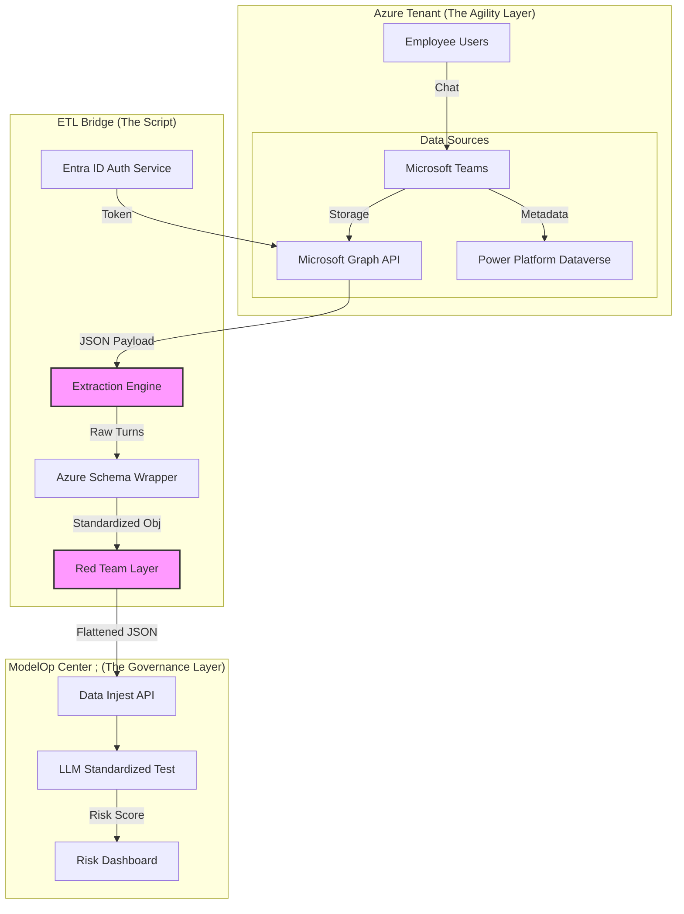
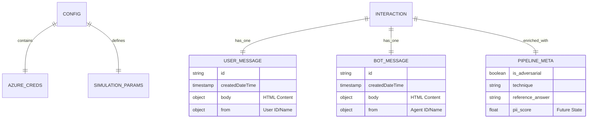
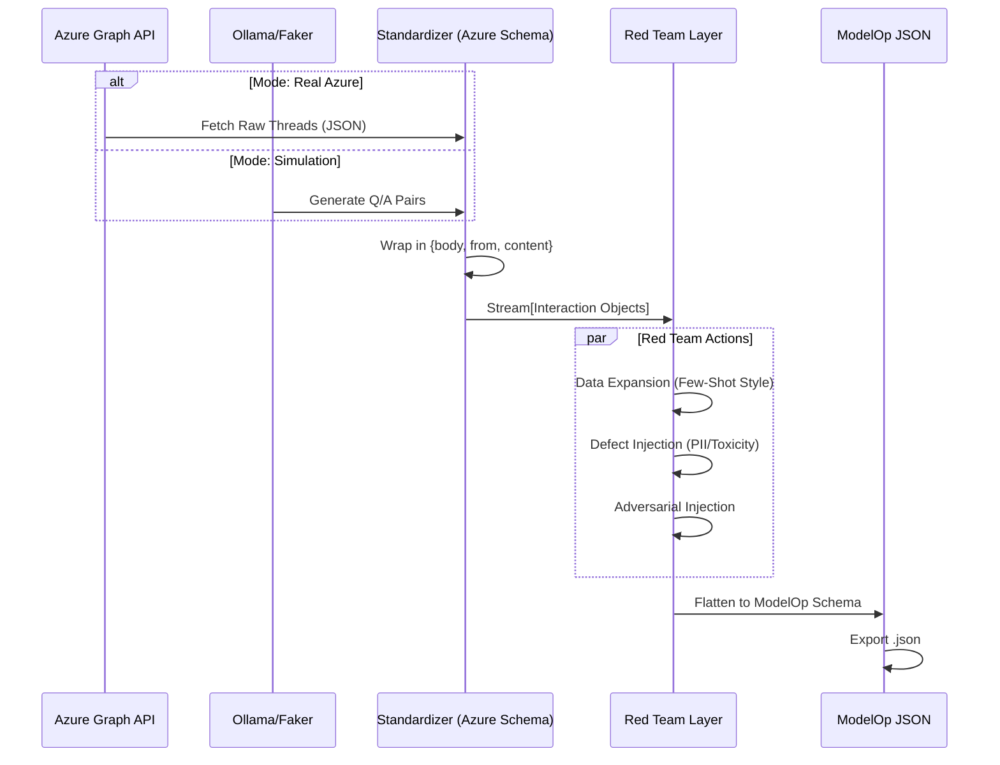

<head></head>

# Project Roadmap: Azure Copilot Data Bridge for ModelOp Center

Meta-Prompt / Context:

You are the Lead Enterprise Architect for a Fortune 500 organization deploying Microsoft Copilot. Your objective is to operationalize ModelOp Center as the "Application Gold Source" (AGS) for AI Governance. This roadmap outlines the transition from the current "Synthetic/Simulation" script to a production-grade ETL pipeline that bridges the "Agility Layer" (Power Platform/Azure) with the "Governance Layer" (ModelOp), ensuring compliance with EU AI Act and NIST AI RMF standards.

## 1. Visual Architecture & Design

### A. System Architecture (Information Systems View)

This diagram illustrates the flow of data from the "Shadow AI" and "Official Copilot" estates through the ETL bridge and into ModelOp for governance.

### B. Component Entity Relationship Diagram (ERD)

These are the internal data structures managed by the Python script to ensure seamless transition between "Real" and "Synthetic" data streams.

### C. Data Flow Sequence Diagram

Visualizing the "Convergence Point" where simulated Red Team data merges with live production traffic.

## 2. Implementation Status & Progress

| **Module** | **Feature** | **Status** | **Notes** |
| --- | --- | --- | --- |
| **Core** | Config Loading & Logging | ✅ Complete | `config.yaml` structure is robust. |
| **Simulation** | Synthetic Data Gen (Ollama) | ✅ Complete | Fully functional. |
| **Transformation** | Azure Schema Standardization | ✅ Complete | `wrap_in_azure_schema` implemented. |
| **Red Teaming** | Adversarial Injection | ✅ Complete | Agnostic injection logic works. |
| **Red Teaming** | Data Expansion (Few-Shot) | ✅ Complete | Mimicry logic active. |
| **Azure Conn** | **Graph API Auth** | 🟡 In Progress | Stubbed. Needs `requests` logic (Sec 3.3.1). |
| **Azure Conn** | **Chat Retrieval Logic** | 🔴 Pending | Needs pagination & filtering (Sec 3.3.3). |
| **Hardening** | **State Management (Cursor)** | 🔴 Pending | Critical for production (Sec 3.4). |
| **Hardening** | **Retry Policies** | 🔴 Pending | Required for network flakes (Sec 5.2). |
| **Transformation** | **HTML Sanitization** | 🟡 Partial | Regex used; need `BeautifulSoup` (Sec 4.1). |

## 3. Development Checklist (Step-by-Step)

### Phase 1: Real Azure Connectivity (Sections 3.1 - 3.3)

*Objective: Replace the `fetch_real_azure_stream` stub with actual Graph API logic.*

- [ ] **1.1 App Registration Config**:

    - [ ] Implement "Certificate" based authentication logic (replacing Client Secret string) for higher security (Sec 3.1).
    - [ ] Validate specific permissions in token scope: `Chat.Read.All`, `User.Read.All` (Sec 3.2).
- [ ] **1.2 User/Agent Resolution**:

    - [ ] Create function to resolve `User IDs` to `DisplayNames` via `/users/{id}` endpoint (prevents stale group data issues mentioned in Sec 2.3).
    - [ ] Implement `AGENT_GUID` lookup filter to isolate "Copilot" chats vs Human-Human chats (Sec 3.3.2).
- [ ] **1.3 Pagination Engine**:

    - [ ] Implement `while` loop for `@odata.nextLink` handling (Sec 3.3.4).
    - [ ] Ensure loop breaks gracefully on API rate limits (HTTP 429).

### Phase 2: Operational Hardening (Sections 3.4 & 5.2)

*Objective: Ensure the script can run as a persistent background service without crashing.*

- [ ] **2.1 State Management (The Cursor)**:

    - [ ] Create `cursor.json` to store `last_processed_message_timestamp`.
    - [ ] Update script to read cursor on start and only query `createdDateTime > last_processed`.
- [ ] **2.2 Resiliency**:

    - [ ] Wrap `requests.get/post` calls in a `Tenacity` retry decorator with exponential backoff (handling "JDBC Connection" style network drops - Sec 5.2).
    - [ ] Add structured logging for "Request IDs" to aid troubleshooting.

### Phase 3: Advanced Data Transformation (Section 4)

*Objective: Ensure high fidelity in the data being fed to the Standardized Test.*

- [ ] **3.1 HTML & Adaptive Card Parsing**:

    - [ ] Replace basic regex with `BeautifulSoup` for cleaner text extraction (Sec 4.1).
    - [ ] **CRITICAL**: Add logic to parse `attachments` array. If `body.content` is empty (common in Copilot Adaptive Cards), extract text from the card JSON.
- [ ] **3.2 Turn Reconstruction**:

    - [ ] Implement "Concatenation Logic": If User sends 3 messages before Bot replies, merge them into one `Prompt` (Sec 4.2).
- [ ] **3.3 Metadata Enrichment**:

    - [ ] Inject `department` or `team_name` into the `context` field for ModelOp Faceted Dashboarding (Sec 4.4).

## 4. Troubleshooting & Validation Tests (Section 5 & 7)

*Use these tests to validate the robustness of the implementation against known failure modes documented in the POC.*

### Test A: The "Regex Filter" Simulation (Sec 5.1)

*Scenario: Ensuring user identity syncing doesn't break due to formatting.*

1. **Action**: Configure a Mock User ID with special characters (e.g., `ModelOp_EntAI$User`).
2. **Expected**: Script should properly URL-encode the ID when querying Graph API.
3. **Failure State**: 404 Not Found or 400 Bad Request.

### Test B: The "Network Partition" (Sec 5.2)

*Scenario: Simulating the "JDBC Connection" errors.*

1. **Action**: Disconnect network / block traffic to `graph.microsoft.com` mid-execution.
2. **Expected**: Script logs warning, enters "Retry" loop (Backoff: 2s, 4s, 8s).
3. **Failure State**: Script crashes with Unhandled Exception `ConnectionError`.

### Test C: The "Adaptive Card" Ghost (Sec 4.1)

*Scenario: Copilot sends a rich card instead of text.*

1. **Action**: Feed a mock payload with `body.content: ""` and a populated `attachments` array.
2. **Expected**: Output JSON `response` field contains text extracted from the attachment.
3. **Failure State**: `response` is empty string (causes ModelOp Test to error).

### Test D: The "Async" Stall (Sec 3.4)

*Scenario: Process crash recovery.*

1. **Action**: Hard kill the script after 50 records. Restart script.
2. **Expected**: Script resumes querying from Record 51 (reading from `cursor.json`).
3. **Failure State**: Script starts from Record 0 (Duplicate Data Ingestion).